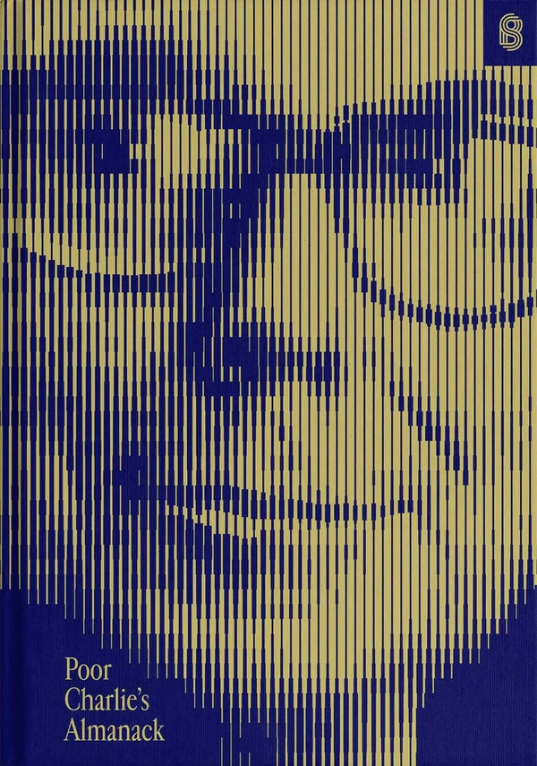

# Line Screen Halftone Generator

A browser-based tool that converts any image into a line screen halftone effect — inspired by the *Poor Charlie's Almanack* book cover.



## What it does

Upload an image and it's rendered in real-time as parallel lines whose thickness varies with the brightness of the underlying pixels — brighter areas produce thicker lines, darker areas produce thinner ones. The result is a two-color graphic that looks like a lithograph or engraving.

## Controls

| Control | Description |
|---------|-------------|
| **Foreground Color** | Color of the lines |
| **Background Color** | Color between the lines |
| **Line Size** | Line density (fewer lines = bolder effect) |
| **Contrast** | Amplifies tonal differences in the source image |
| **Exposure** | Offsets overall luminance before halftoning |
| **Highlights** | Pulls down bright areas to recover highlight detail |
| **Shadows** | Lifts dark areas to open up shadow detail |
| **Blur** | Pre-blurs the image to smooth out noise before halftoning |
| **Invert** | Swaps foreground and background tones |

Download the result as a full-resolution PNG matching the original image dimensions.

## Stack

- Vite + TypeScript
- Raw WebGL with custom GLSL fragment shader
- No runtime dependencies

## Run locally

```bash
npm install
npm run dev
```

Open [http://localhost:5173](http://localhost:5173).
